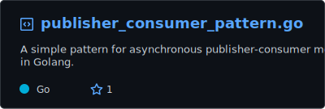

Hi,
I am a Golang Backend Engineer who swims with Kubernetes and rows with cool DevOps stuffs!

> Experienced in crafting scalable, resilient backend systems using Golang. Proficient in building custom controllers, operators, and CRDs for Database management on Kubernetes. Passionate about CI/CD, automation, and performance optimization. Got problem-solving skills and a competitive programming background.

### Stats

    

<!-- ### Gists -->

<!--  -->

<h3 align="left">Find Me On:</h3> 

    
    
    
    

<h3 align="left">Connect with me:</h3> 

    
    

📫 - shoot an email at <b>obaydullahmhs@gmail.com</b>

 
  
